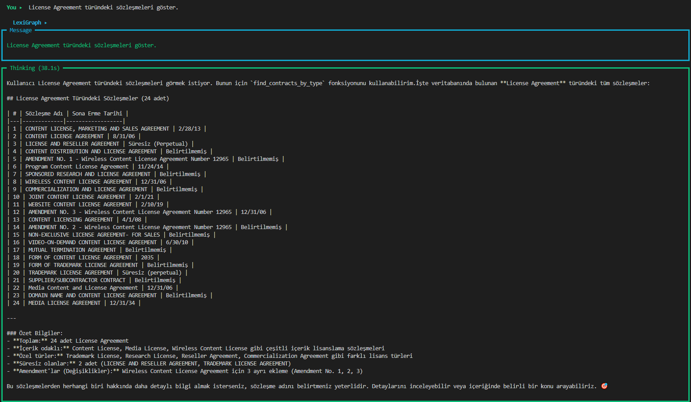
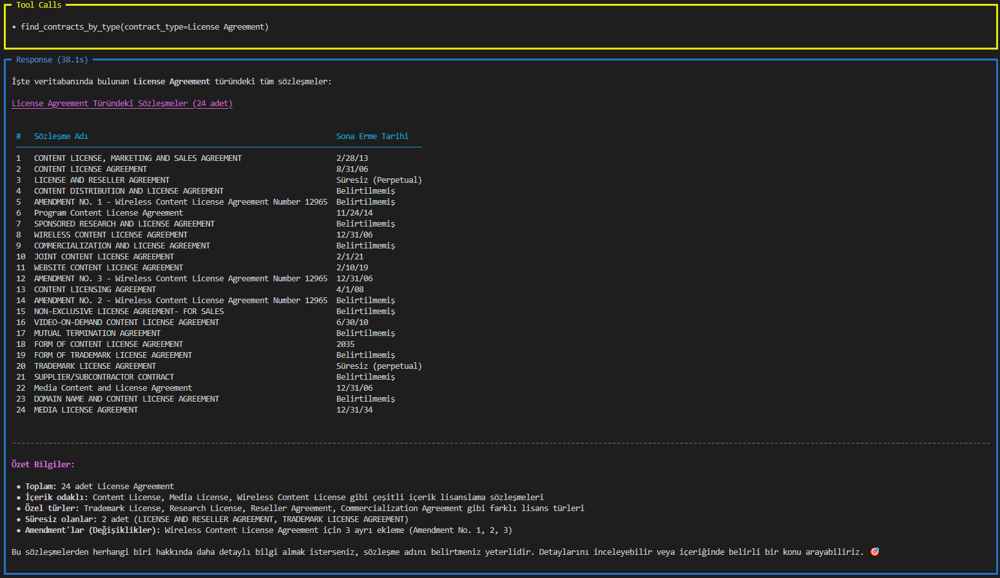
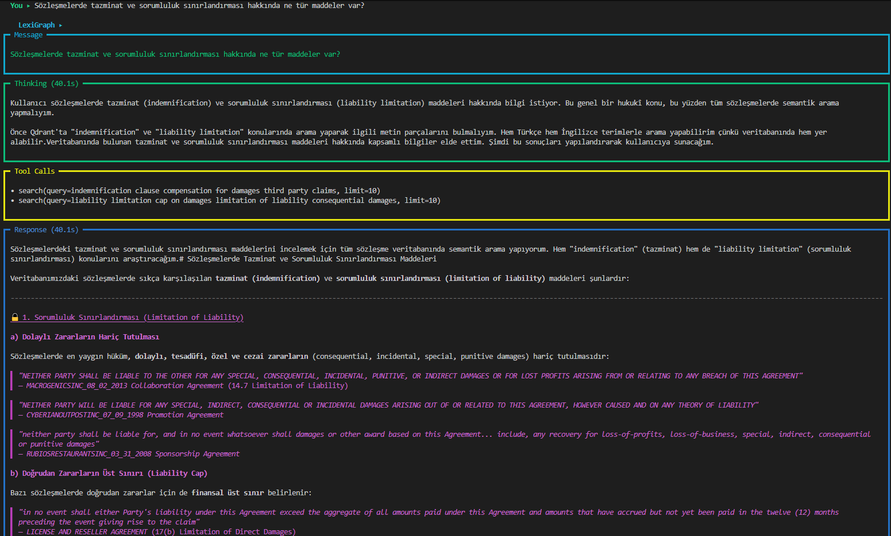
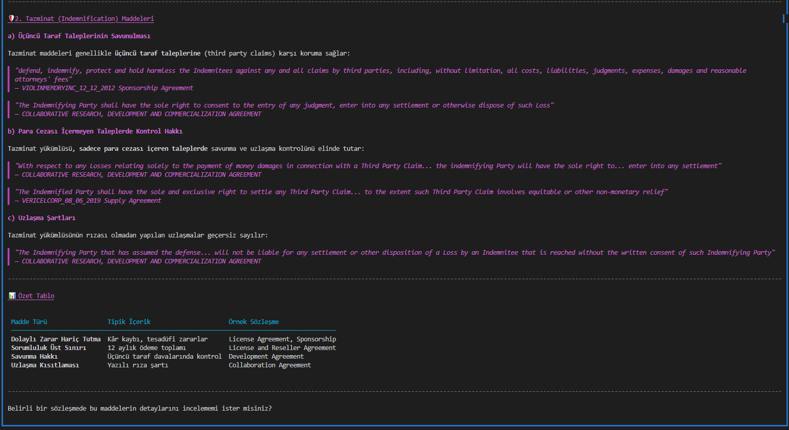

<p align="center">
  <h1 align="center">⚖️ LexiGraph</h1>
  <p align="center">
    <strong>AI-Powered Legal Contract Analysis with Graph & Vector Databases</strong>
  </p>
  <p align="center">
    <em>MCP (Model Context Protocol) ile Neo4j ve Qdrant veritabanlarını birleştiren<br>hukuki sözleşme analiz platformu</em>
  </p>
</p>

<p align="center">
  
  
  
  
  
</p>

### 🔍 Demo: Neo4j Graph Query — `find_contracts_by_type`

> *"License Agreement türündeki sözleşmeleri göster."*

<p align="center">
  
</p>
<p align="center">
  
</p>

### 📄 Demo: Qdrant Semantic Search — `search`

> *"Sözleşmelerde tazminat ve sorumluluk sınırlandırması hakkında ne tür maddeler var?"*

<p align="center">
  
</p>
<p align="center">
  
</p>

---

## 📖 Table of Contents

- [Overview](#overview)
- [Architecture](#architecture)
- [Tech Stack](#tech-stack)
- [Project Structure](#project-structure)
- [Setup & Installation](#setup--installation)
- [Usage](#usage)
- [MCP Tools Reference](#mcp-tools-reference)
- [Data Model](#data-model)
- [License](#license)

---

## Overview

**LexiGraph**, hukuki sözleşmeleri analiz etmek için iki farklı veritabanı yaklaşımını birleştiren bir AI platformudur:

- **Neo4j (Graph Database)** — Sözleşme yapısal ilişkilerini (taraflar, sözleşme türleri, yargı alanları, boolean madde bayrakları) graph olarak modeller
- **Qdrant (Vector Database)** — Sözleşme tam metinlerini semantik chunk'lara bölerek doğal dil ile aranabilir hale getirir

Bu iki veritabanı, **MCP (Model Context Protocol)** sunucuları üzerinden bir AI agent'a bağlanır. Agent, kullanıcının doğal dil sorularını analiz ederek hangi veritabanını kullanacağına otomatik karar verir ve çapraz veritabanı sorgulama ile kapsamlı yanıtlar üretir.

### Temel Yetenekler

| Yetenek | Açıklama |
|---------|----------|
| 🔍 **Semantik Arama** | Doğal dil ile sözleşme metinlerinde arama (Qdrant) |
| 🕸️ **Graph Sorguları** | Taraf, tür, yargı alanı bazlı yapısal sorgulama (Neo4j) |
| 🤖 **AI Agent** | İki MCP sunucusunu otomatik koordine eden akıllı asistan |
| 💬 **Terminal Chat** | İnteraktif terminal tabanlı sohbet arayüzü |
| 🔗 **Çapraz Veritabanı** | Graph + Vector sonuçlarını birleştirerek zengin yanıtlar |
| 📊 **30+ Madde Analizi** | Non-compete, exclusivity, license grant vb. boolean analiz |

---

## Architecture

```
┌───────────────────────────────────────────────────────────────┐
│                         USER (Terminal)                        │
│                        python -m app.agent.chat                │
└──────────────────────────────┬────────────────────────────────┘
                               │
                    ┌──────────▼──────────┐
                    │    Agno AI Agent     │
                    │  (LLM + MCP Tools)  │
                    └──────┬──────┬───────┘
                           │      │
              ┌────────────▼┐    ┌▼────────────┐
              │  MCP Server │    │  MCP Server  │
              │   (Qdrant)  │    │   (Neo4j)    │
              │  port:8080  │    │  port:8081   │
              └──────┬──────┘    └──────┬───────┘
                     │                  │
           ┌─────────▼─────────┐  ┌────▼──────────────┐
           │    Qdrant DB      │  │    Neo4j DB        │
           │  (Vector Store)   │  │  (Graph Store)     │
           │                   │  │                    │
           │ • Contract chunks │  │ • Contract nodes   │
           │ • Embeddings      │  │ • Party nodes      │
           │ • Semantic search │  │ • Type nodes       │
           │                   │  │ • Law nodes        │
           │                   │  │ • Relationships    │
           └───────────────────┘  └────────────────────┘
```

---

## Tech Stack

| Kategori | Teknoloji | Açıklama |
|----------|-----------|----------|
| **AI Framework** | [Agno](https://github.com/agno-agi/agno) | Agent orchestration & MCP entegrasyonu |
| **LLM** | OpenRouter API | Yapılandırılabilir model desteği |
| **Graph DB** | [Neo4j 5.x](https://neo4j.com/) | Sözleşme ilişkileri için graph veritabanı |
| **Vector DB** | [Qdrant](https://qdrant.tech/) | Semantik arama için vektör veritabanı |
| **MCP** | [FastMCP](https://github.com/jlowin/fastmcp) | Model Context Protocol sunucuları |
| **Embedding** | [all-MiniLM-L6-v2](https://huggingface.co/sentence-transformers/all-MiniLM-L6-v2) | 384-dim sentence embeddings |
| **Text Splitter** | LangChain | RecursiveCharacterTextSplitter |
| **Language** | Python 3.12+ | Type hints, async/await |

---

## Project Structure

```
LexiGraph/
├── README.md
├── app/
│   ├── config.json              # Veritabanı ve API konfigürasyonu
│   ├── config.py                # Konfigürasyon yükleyici
│   │
│   ├── agent/                   # 🤖 AI Agent Katmanı
│   │   ├── agent_prompt.py      # System prompt (tool açıklamaları dahil)
│   │   ├── agno_agent.py        # Agent factory & runner
│   │   ├── chat.py              # İnteraktif terminal uygulaması
│   │   └── test.py              # Hızlı test scripti
│   │
│   ├── mcp/                     # 🔌 MCP Sunucuları
│   │   ├── neo4j_mcp.py         # Neo4j MCP tool server (8 tool)
│   │   └── qdrant_mcp.py        # Qdrant MCP tool server (3 tool)
│   │
│   ├── services/                # ⚙️ Servis Katmanı
│   │   ├── neo4j_service.py     # Neo4j bağlantı & sorgu yönetimi
│   │   ├── qdrant_service.py    # Qdrant bağlantı & arama yönetimi
│   │   └── embedding_service.py # Sentence-transformer model yönetimi
│   │
│   └── db/                      # 🗄️ Veritabanı Build
│       ├── build_/
│       │   ├── build_neo4j.py   # CSV → Neo4j graph builder
│       │   └── build_qdrant.py  # TXT → Qdrant vector builder
│       └── data/
│           ├── master_clauses.csv    # Sözleşme metadata (546 kayıt)
│           └── full_contract_txt/    # Sözleşme tam metinleri (.txt)
```

---

## Setup & Installation

### 1. Gereksinimler

- Python 3.12+
- Docker (Neo4j ve Qdrant için)

### 2. Veritabanlarını Başlatın

```bash
# Neo4j
docker run -d --name neo4j \
  -p 7074:7474 -p 7076:7687 \
  -e NEO4J_AUTH=neo4j/lexigraph123 \
  -e NEO4J_PLUGINS='["apoc"]' \
  -v neo4j_data:/data -v neo4j_logs:/logs \
  neo4j:5-community

# Qdrant
docker run -d --name qdrant \
  -p 6333:6333 -p 6334:6334 \
  -v qdrant_storage:/qdrant/storage \
  qdrant/qdrant
```

| Servis | Port | Adres |
|--------|------|-------|
| Neo4j Browser | 7074 | http://localhost:7074 |
| Neo4j Bolt | 7076 | bolt://localhost:7076 |
| Qdrant REST | 6333 | http://localhost:6333 |
| Qdrant gRPC | 6334 | localhost:6334 |
| Qdrant Dashboard | 6333 | http://localhost:6333/dashboard |

### 3. Python Bağımlılıklarını Kurun

```bash
pip install agno fastmcp neo4j qdrant-client sentence-transformers \
            langchain-text-splitters torch
```

### 4. Konfigürasyon

`app/config.json` dosyasını oluşturun:

```json
{
    "neo4j": {
        "uri": "bolt://localhost:7076",
        "username": "neo4j",
        "password": "lexigraph123",
        "database": "neo4j"
    },
    "qdrant": {
        "host": "localhost",
        "port": 6333,
        "grpc_port": 6334,
        "collection_name": "lexigraph"
    },
    "mcp": {
        "host": "127.0.0.1",
        "qdrant_port": 8080,
        "neo4j_port": 8081
    },
    "llm": {
        "base_url": "https://openrouter.ai/api/v1",
        "api_key": "YOUR_API_KEY",
        "model_id": "your-model-id"
    }
}
```

### 5. Veritabanlarını Doldurun

```bash
# Neo4j graph'ını oluştur (CSV'den)
python -m app.db.build_.build_neo4j

# Qdrant vektörlerini oluştur (TXT'lerden)
python -m app.db.build_.build_qdrant
```

---

## Usage

### MCP Sunucularını Başlatın

İki ayrı terminalde MCP sunucularını çalıştırın:

```bash
# Terminal 1 — Qdrant MCP (port 8080)
python -m app.mcp.qdrant_mcp

# Terminal 2 — Neo4j MCP (port 8081)
python -m app.mcp.neo4j_mcp
```

### Terminal Chat Uygulaması

```bash
# Varsayılan olarak başlat
python -m app.agent.chat

# Kullanıcı ve oturum belirterek başlat
python -m app.agent.chat --user emrullah --session my-session
```

#### Komutlar

| Komut | Açıklama |
|-------|----------|
| `/help` | Yardım menüsünü göster |
| `/clear` | Ekranı temizle |
| `/new` | Yeni oturum başlat |
| `/quit` | Programdan çık |

#### Örnek Sorular

```
▸ Veritabanında kaç sözleşme var?
▸ Non-compete clause içeren sözleşmeleri listele.
▸ "MARKETING AFFILIATE AGREEMENT" sözleşmesinin tarafları kimler?
▸ License Agreement türündeki sözleşmeleri göster.
▸ California hukukuna tabi sözleşmeleri bul.
▸ Indemnification hakkında hangi sözleşmelerde bilgi var?
```

### Tek Sorgu Testi

```bash
python -m app.agent.test
```

---

## MCP Tools Reference

### Neo4j MCP Server (8 Tools)

| # | Tool | Parametreler | Açıklama |
|---|------|-------------|----------|
| 1 | `get_schema()` | — | Graph şemasını döner (labels, relationships, properties) |
| 2 | `get_node_labels()` | — | Tüm node label'ları ve sayıları |
| 3 | `get_node_properties(label)` | `label: str` | Belirli bir label'ın property şeması |
| 4 | `execute_cypher(query, params)` | `query: str, params: dict` | Salt-okunur Cypher sorgusu çalıştırır |
| 5 | `get_stats()` | — | Graph genel istatistikleri |
| 6 | `find_contracts_by_party(party_name)` | `party_name: str` | Taraf adına göre sözleşme arar |
| 7 | `find_contracts_by_type(contract_type)` | `contract_type: str` | Sözleşme türüne göre arar |
| 8 | `get_contract_detail(contract_name)` | `contract_name: str` | Sözleşmenin tüm detayları |
| 9 | `get_relationships(label, property_key, property_value)` | `label, key, value: str` | Node'un tüm ilişkileri |

### Qdrant MCP Server (3 Tools)

| # | Tool | Parametreler | Açıklama |
|---|------|-------------|----------|
| 1 | `search(query, limit)` | `query: str, limit: int` | Tüm sözleşmelerde semantik arama |
| 2 | `search_on_spesific_contract(contract_name, query, limit)` | `contract_name, query: str` | Belirli sözleşmede semantik arama |
| 3 | `get_chunks_of_contract(contract_name, start_index, end_index)` | `contract_name: str, start/end: int` | Sözleşme metin chunk'larını sıralı döner |

---

## Data Model

### Neo4j Graph Schema

```
                    ┌──────────────┐
                    │ ContractType │
                    │  (name)      │
                    └──────▲───────┘
                           │ IS_TYPE
                           │
┌─────────┐  SIGNED_BY  ┌──┴───────────────┐  GOVERNED_BY  ┌──────────────┐
│  Party  │◄────────────│    Contract       │──────────────►│ GoverningLaw │
│ (name)  │             │ (contract_name)   │               │(jurisdiction)│
└─────────┘             │ agreement_date    │               └──────────────┘
                        │ effective_date    │
                        │ expiration_date   │
                        │ non_compete       │
                        │ exclusivity       │
                        │ license_grant     │
                        │ ... (+27 flags)   │
                        └───────────────────┘
```

### Qdrant Vector Schema

Her bir chunk için:
- **vector**: 384-dim sentence embedding (all-MiniLM-L6-v2)
- **payload**:
  - `contract_name`: Neo4j Contract node ile bağlantı anahtarı
  - `chunk_index`: Sözleşme içindeki sıra numarası
  - `text`: Chunk metni (~512 karakter)

### Veri Seti

- **546 sözleşme** — master_clauses.csv (yapısal metadata)
- **25 sözleşme türü** — Affiliate, License, Service, Development, vb.
- **30+ boolean madde** — Non-compete, exclusivity, license grant, audit rights, vb.
- **Tam metin chunk'ları** — RecursiveCharacterTextSplitter (512 char, 64 overlap)

---

## License

Bu proje eğitim ve kişisel kullanım amaçlıdır.
Sözleşme veri seti [CUAD (Contract Understanding Atticus Dataset)](https://www.atticusprojectai.org/cuad) kaynaklıdır.
